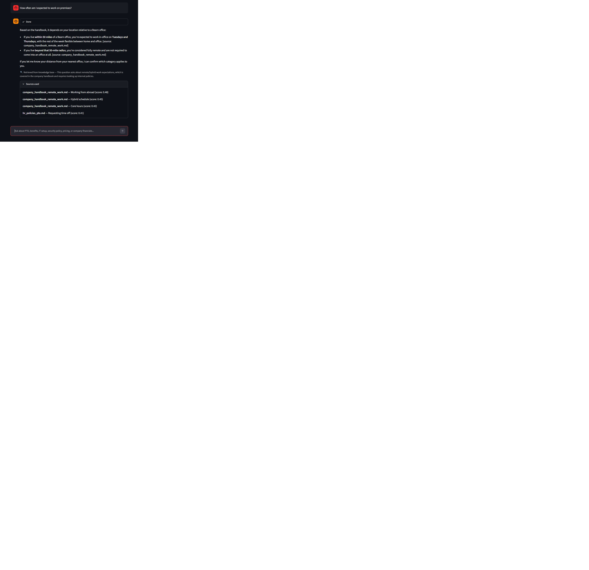

# Nova - Bearn Assistant

An agentic RAG chatbot demo built with **LangGraph** and the **Claude API**, backed by a local **FAISS** vector store over a fictional company's internal knowledge base.

Every incoming query first passes through a light classification step that decides whether it actually needs document lookup at all. Chit-chat ("What can you do?") gets answered directly while policy/product questions trigger a tool knowledge-base search. The Streamlit UI displays the decision live, so you can watch the agent choose its own path per query.

**This is a portfolio/demo project. "Bearn Analytics," its employees, and its policies are entirely fictional.**

<table>
<tr>
<td width="50%" valign="top">

**Direct answer with no lookup**


</td>
<td width="50%" valign="top">

**RAG answer with sources cited**



</td>
</tr>
</table>

## Build

- **Claude SDK used directly,** LangGraph only needs `langchain-core`'s graph primitives — it doesn't require the full `langchain` framework or its provider integrations, this being a local demo. Calling `anthropic.Anthropic()` directly keeps the dependency surface small and the LLM calls easy to read.
- **Two-model split.** Routing uses a small, fast Claude model (cheap, low-latency classification via a forced tool call) while generation uses a stronger model for the actual answer.
- **Ingestion is seperate**. `python -m ragbot.ingest` builds `vector_store/` from `data/knowledge_base/` and has already been done. The app and the graph only ever read that artifact via `retriever.py`.
- **Fully local embeddings + vector store.** `sentence-transformers` (CPU, no API key) + FAISS mean the retrieval half of the stack costs nothing and needs no signup — the only paid dependency is the Claude API calls themselves using your own API-key assigned in the .env.
- **Deterministic tests** The dummy knowledge base was written with specific, unique facts per document (e.g. only one doc mentions "Tailscale"), so retrieval tests assert an exact expected source file rather than "returned something plausible." The model should also be able to acknowledge lack of knowledge.

## Architecture

```
                    ┌──────────────┐
   query ──────────▶│  route_query │  (Claude, forced tool call: needs_retrieval?)
                    └──────┬───────┘
                           │
                 ┌─────────┴─────────┐
                 │                   │
          needs_retrieval      chit-chat/meta
                 │                   │
                 ▼                   ▼
          ┌─────────────┐   ┌─────────────────┐
          │  retrieve   │   │ generate_direct │
          │ (FAISS +    │   └────────┬────────┘
          │  sentence-  │            │
          │  transformers)          END
          └──────┬──────┘
                 ▼
     ┌───────────────────────┐
     │ generate_with_context │  (Claude, cites [source: file])
     └───────────┬───────────┘
                 ▼
                END
```

State, nodes, and edges live in [`src/ragbot/graph.py`](src/ragbot/graph.py).

## Project layout

```
data/knowledge_base/     11 fictional Bearn Analytics docs (HR, IT, security, product, finance)
                          — markdown files chunked by ## header; economy_quarterly_financials.csv
                          chunked one row per chunk (see ingest.py)
src/ragbot/
  config.py               env vars, model names, paths
  ingest.py                chunk -> embed -> FAISS  (python -m ragbot.ingest)
  retriever.py             loads the persisted index, retrieve(query, k)
  prompts.py                router + generation system prompts
  llm.py                    thin anthropic SDK wrappers
  graph.py                  the LangGraph StateGraph
vector_store/              committed FAISS index + chunk metadata (rebuildable)
app.py                     Streamlit chat UI
scripts/run_eval.py        CLI eval harness (routing + retrieval + answer checks)
tests/                     pytest suite (retriever tests need no API key; graph tests do)
```

## Quick start

<details open>
<summary><strong>macOS / Linux</strong></summary>

```bash
git clone <this-repo>
cd rag-project
python3 -m venv .venv
source .venv/bin/activate
pip install -r requirements.txt
cp .env.example .env   # then add your ANTHROPIC_API_KEY

streamlit run app.py
```

</details>

<details>
<summary><strong>Windows (PowerShell)</strong></summary>

```powershell
git clone <this-repo>
cd rag-project
python -m venv .venv
.venv\Scripts\Activate.ps1
pip install -r requirements.txt
Copy-Item .env.example .env   # then add your ANTHROPIC_API_KEY

streamlit run app.py
```

</details>

The vector store in `vector_store/` is already committed as previously mentioned. No ingestion step is required to run the demo. If you edit `data/knowledge_base/`, rebuild it with:

```bash
python -m ragbot.ingest
```

## Example queries to try

| Query | Expected routing | Expected source |
|---|---|---|
| "How many PTO days do new employees get?" | retrieve | `hr_policies_pto.md` → 15 days |
| "What VPN tool does the company use?" | retrieve | `it_setup_vpn_access.md` → Tailscale |
| "What's the data refresh rate on the Enterprise plan?" | retrieve | `product_faq_features.md` → real-time |
| "Who led the company's seed funding round?" | retrieve | `economy_annual_report_summary.md` → Cascade Ventures |
| "What's the hotel spend cap for business travel?" | retrieve | `finance_expense_policy.md` → $250/night standard |
| "hi" / "what can you do?" / "thanks!" | direct | — no lookup |

## Testing

```bash
pip install -r requirements-dev.txt
pytest tests/test_retriever.py
pytest tests/test_graph.py
python scripts/run_eval.py
```

## Configuration

All configuration is environment-variable driven (see `.env.example`), but is by default set as:

| Variable | Default | Purpose |
|---|---|---|
| `ANTHROPIC_API_KEY` | — | required |
| `ROUTER_MODEL` | `claude-haiku-4-5-20251001` | routing classification |
| `GENERATION_MODEL` | `claude-sonnet-5` | answer generation |

## License

MIT — see [LICENSE](LICENSE).
